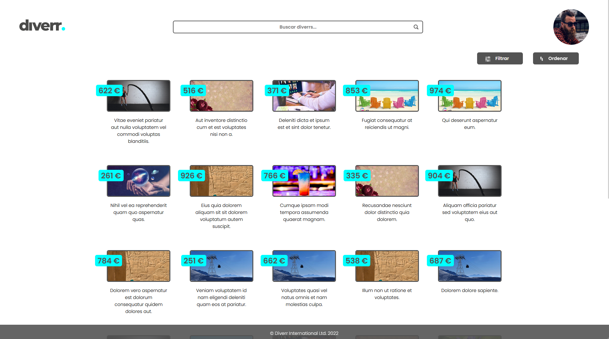
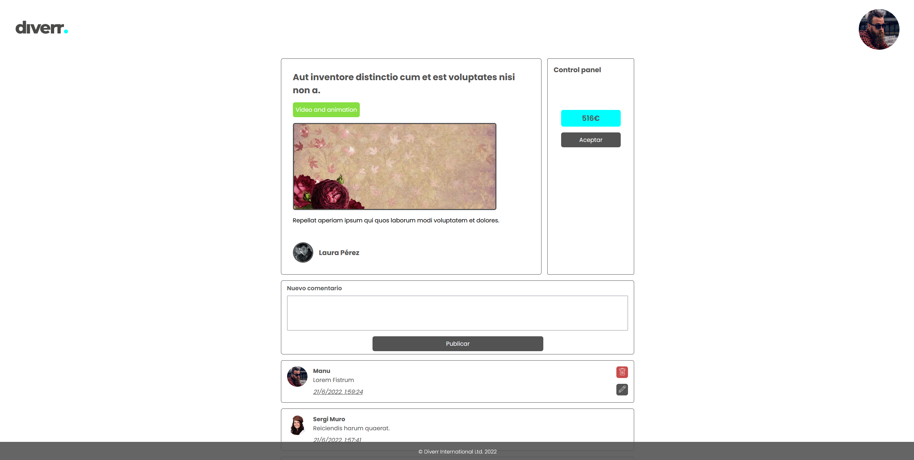
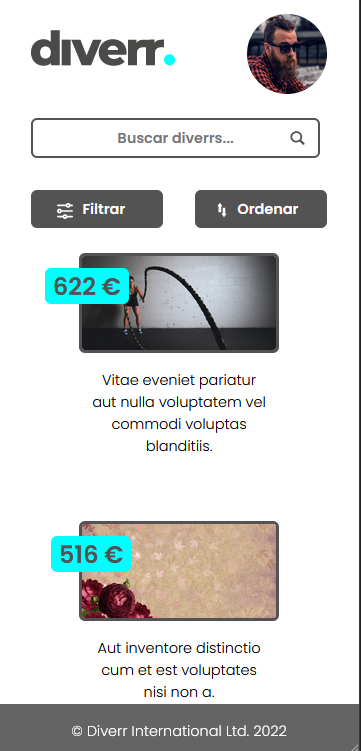
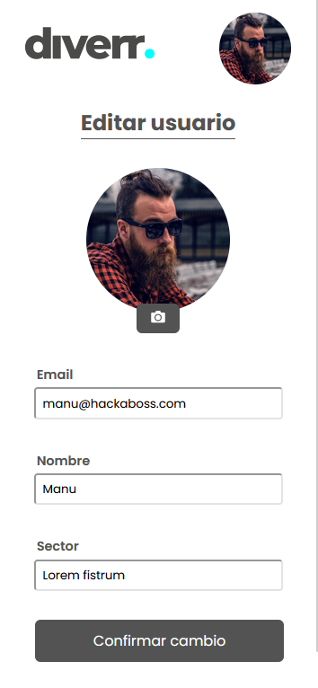
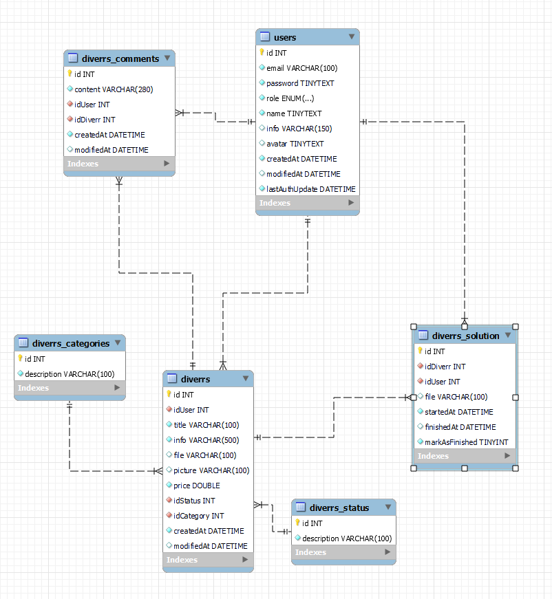

&nbsp;

&nbsp;

Diverr es una plataforma web donde las personas que necesiten algún servicio digital puedan pedir ayuda a otros usuarios). Por ejemplo: traducir un
texto, editar una foto, revisar un documento, etc… Solo necesidades que puedan realizarse
mediante un fichero digital.

Cada necesidad digital se denomina diverr. Un usuario registrado puede crear sus propios diverrs o bien solucionar los de otros.

&nbsp;

&nbsp;

&nbsp;

&nbsp;

## Backend

### Estructura de base de datos

- Tabla de usuario:

  - id
  - email \*
  - password \*
  - role \*
  - name
  - info
  - avatar
  - createdAt
  - modifiedAt
  - lastAuthUpdate

- Tabla de diverrs:

  - id
  - idUser \*
  - title \*
  - info \*
  - file
  - picture
  - price
  - idStatus \*
  - idCategory \*
  - createdAt
  - modifiedAt

- Tabla de estados de un diverr:

  - id
  - description \*

- Tabla de categorias de un diverr:

  - id
  - description \*

- Tabla de soluciones de diverr:

  - id
  - idDiverr \*
  - idUser \*
  - file
  - startedAt
  - finishedAt
  - markAsFinished

- Tabla de comentarios de un servicio:
  - id
  - content \*
  - idUser \*
  - idDiverr \*
  - createdAt
  - modifiedAt

#### Diagrama de la base de datos

### Endpoints

#### Endpoints de usuarios

- `POST /users` - Registrar un usuario. ✅ ✅

  - Cabecera auth: No
  - Body:
    - email
    - password
    - name
  - Retorna: mensaje que indica que el usuario ha sido creado y el id.

&nbsp;

- `GET /users/` - Obtener información del usuario que hace la petición. ✅ ✅

  - Cabecera auth: Sí
  - Retorna: info de usuario.

&nbsp;

- `POST /users/login` - Hacer login y retornar un token. ✅ ✅

  - Cabecera auth: No
  - Body:
    - email
    - password
  - Retorna: un token.

&nbsp;

- `PUT /users` - Editar la información almacenada del usuario del usuario que hace la petición. ✅ ✅

  - Cabecera auth: Si
  - Body:
    - email
    - nombre
    - bio
    - avatar
  - Retorna: mensaje que indica que el usuario ha sido modificado.

&nbsp;

- `PUT /users/password` - Editar la contraseña del usuario que hace la petición. ✅ ✅

  - Cabecera auth: Si
  - Body:
    - oldPassword
    - newPassword
  - Retorna: mensaje que indica que la contraseña ha sido modificada.

&nbsp;

- `DELETE /users/:idUser` - Eliminar un usuario. ✅ ✅

  - Cabecera auth: Si
  - Path Params:
    - idUser
  - Retorna: mensaje que indica que el usuario ha sido eliminado.

&nbsp;

- `DELETE /users/:idUser` - Eliminar un usuario. ✅ ✅

  - Cabecera auth: Si
  - Path Params:
    - idUser
  - Retorna: mensaje que indica que el usuario ha sido eliminado.

&nbsp;

- `GET /users/diverr` - Devuelve todas las necesidades creadas por un usuario. ✅ ✅

  - Cabecera auth: Si
  - Path Params:
    - idUser
  - Retorna: info de los diverrs abiertos.

&nbsp;

- `GET /users/solution` - Devuelve todas las soluciones asignadas a un usuario. ✅ ✅

  - Cabecera auth: Si
  - Path Params:
    - idUser
  - Retorna: info de los soluciones asignadas.

&nbsp;

#### Endpoints de diverrs

- `GET /diverr` - Obtener un listado de todos los diverrs. ✅ ✅

  - Cabecera auth: No
  - Querystring:
    - search
    - order (title,status,category o price)
    - direction
  - Retorna: info de todos los diverrs.

  &nbsp;

- `GET /diverr/:idDiverr` - Obtener un diverr/necesidad en concreto ✅ ✅

  - Cabecera auth: No
  - Path Params:
    - idDiverr
  - Retorna: info de un diverr.

&nbsp;

- `POST /diverr` - Crear un diverr/necesidad ✅ ✅

  - Cabecera auth: Si
  - Body:
    - title
    - info
    - category
    - file
    - picture
    - price
  - Retorna: mensaje que indica que se ha generado el diverr

&nbsp;

- `PUT /diverr/:idDiverr` - Editar un diverr/necesidad ✅ ✅

  - Cabecera auth: Si
  - Path Params:
    - idDiverr
  - Body:
    - title
    - info
    - category
    - file
    - picture
    - price
  - Retorna: mensaje que indica que el diverr ha sido editado

&nbsp;

- `DELETE /diverr/:idDiverr` - Borrar un diverr/necesidad ✅ ✅

  - Cabecera auth: Si
  - Path Params
    - idDiverr
  - Retorna: mensaje que indica que se ha generado el diverr

&nbsp;

- `POST /diverr/:idDiverr/solution` - Crea una solución a una necesidad/diverr ✅ ✅

  - Cabecera auth: Si
  - Path Params:
    - idDiverr
  - Retorna: mensaje que indica que se ha generado una solución

&nbsp;

- `GET /diverr/:idDiverr/solution` - Obtener la solución asignada a una necesidad/diverr ✅ ✅

  - Cabecera auth: Si
  - Path Params:
    - idDiverr
  - Retorna: información de la solución asignada

&nbsp;

- `PUT /diverr/:idDiverr/solution` - Permite editar una solución ✅ ✅

  - Cabecera auth: Si
  - Path Params:
    - idDiverr
  - Body:
    - file
    - finished
  - Retorna: mensaje que indica que se ha modificado la solución

&nbsp;

- `DELETE /diverr/:idDiverr/solution` - Eliminar una solución ✅ ✅

  - Cabecera auth: Si
  - Path Params:
    - idDiverr
  - Retorna: mensaje que indica que se elimino la solución

  &nbsp;

- `POST /diverr/:idDiverr/comments` - Añade un comentario a una necesidad/diverr existente ✅ ✅

  - Cabecera auth: Si
  - Path Params:
    - idDiverr
  - Body:
    - content
  - Retorna: info de todos los comentarios

  &nbsp;

- `GET /diverr/:idDiverr/comments/:idComment` - Devuelve un sólo comentario ✅ ✅

  - Cabecera auth: Si
  - Path Params:
    - idDiverr
    - idComment
  - Retorna: mensaje con el comentario

    &nbsp;

- `GET /diverr/:idDiverr/comments` - Obtener los comentarios de una necesidad/diverr existente ✅ ✅

  - Cabecera auth: Si
  - Path Params:
    - idDiverr
  - Retorna: mensaje con toda la info de los comentarios

  &nbsp;

- `PUT /diverr/:idDiverr/comments/:idComment` - Modificar un comentario ✅ ✅

  - Cabecera auth: Si
  - Path Params:
    - idDiverr
    - idComment
  - Body:
    - content
  - Retorna: mensaje que indica que se modificó el comentario

  &nbsp;

- `DELETE /diverr/:idDiverr/comments/:idComment` - Eliminar un comentario ✅ ✅

  - Cabecera auth: Si
  - Path Params:
    - idDiverr
    - idComment
  - Retorna: mensaje que se eliminó el comentario

  &nbsp;

- `GET /diverr/categories` - Devuelve las diferentes categorias con las que se clasifican los servicios ✅ ✅

  - Cabecera auth: No
  - Path Params:
  - Retorna: mensaje con todos las descripciones existentes

    &nbsp;

- `GET /diverr/status` - Devuelve las diferentes estados por los que pasa un servicio ✅ ✅

  - Cabecera auth: No
  - Path Params:
  - Retorna: mensaje con todos los estados disponibles

    &nbsp;

## Frontend

### Componentes

- `Auth` : Sección del header donde se incluyen los componentes necesarios para iniciar sesión, registrarse o bien, acceder al menú de la aplicación una vez se inicia una sesión de usuario.

- `SearchBar`: Se utiliza para buscar diverrs.

- `Header`: Cabecera de la página. Incluye los componentes Auth y SearchBar

- `Footer`: Pié de la página.

- `CardStiker`: Pequeña pegatina que se añade al componente DiverrCard para visualizar el precio a pagar por la solución de un Diverr.

- `DiverrCard`: Pequeña tarjeta que contiene el titulo, la portada y el precio asignados a un diverr.

- `BusinessPanel`: Panel de acciones sobre un diverr. El renderizado varia en función del usuario y de si tiene o no asignada una solución

- `DiverrGrid`: Tarjeta grande que contiene toda la información de un diverr. Se renderiza en la página correspondiente a dicho diverr.

- `Comment`: Renderiza cada uno de los comentarios de un diverr. Se puede editar o incluso borrar (siempre y cuando el usuario sea el mismo que lo genera)

- `NewComment`: Permite generar un nuevo comentario.

- `InputFieldForm`: Se emplea en los forms, es un input personalizable que además muestra mensajes de error.

- `List`: Un componente genérico para renderizar listas

- `CreateDiverrCard`: Renderiza una tarjeta que nos redirecciona a la página NewDiverPage

- `LoadAvatar`: Se emplea para cargar un imagen de perfil del usuario. Renderiza la imagen actual o bien previsualiza la que se vaya a cargar.

- `MyDiverrsList`: Renderiza una lista con varias DiverrCard y una CreateDiverrCard. Proporciona al usuario la capacidad de navegar hasta sus diverrs abiertos o bien crear uno nuevo

- `ErrorMessage`: Muestra un mensaje de error, devuelve a HomePage.

- `FilterMenu`: Renderiza un menu para filtrar los diverrs de la HomePage en función de su categoria

- `OrderMenu`: Renderiza un menu para ordenar los diverrs de la HomePage según el precio, la fecha, la categoria...etc

### Context

- `AuthContext`: Proporciona un contexto que permite al resto de componente acceder a la información del usuario o al token. Además implementa las funciones de login y logout.

- `QueryContext`: Proporciona un contexto de búsqueda de diverrs de la HomePage. Permite ordenar y filtrar los resultados devueltos por la API de backend

### Hooks

- `useCategories`: Se emplea para devolver todas las categorias existentes en el backend.

- `useComments`: Permite gestionar un array de comentarios de un diverr, con la posibilidad de añadir, borrar o editar cualquier comentario de dicho array

- `useDiverr`: Permite cargar la información de un diverr dado su id

- `useDiverrSolution`: Permite cargar la información de una solución asignada a un diverr dado su id

- `useMyDiverrs`: Permite gestionar un array de los diverrs creados por un usuario

- `useMyDiverrsAssigned`: Permite gestionar un array de las soluciones asignadas a un usuario

#### Pages

- `DiverrPage`: Página de un diverr. Muestra su información, estado y sus comentarios.

- `EditUserPage`: Página para editar información del usuario.

- `HomePage`: Página principal de la aplicación, muestra todos los diverrs existentes y así como un menú para ordenarlos y/o filtrarlos.

- `LoginPage`: Página para iniciar sesión.

- `MyDiverrsPage`: Muestra los diverrs creados por el usuario y los diverrs asignados.

- `NewDiverrPage`: Contiene un formulario para publicar un nuevo Diverr

- `NotFoundPage`: Si se intenta acceder a una ruta que no existe, la aplicación te redirecciona a esta página

- `RegisterPage`: Página para registrarse.

- `SecurityPage`: Página para editar información de seguridad del usuario.

#### Services

- `diverrService`: Conjunto de funciones donde se encuentran todas las peticiones relativas a los diverrs.

- `userService`: Conjunto de funciones donde se encuentran todas las peticiones relativas a los usuarios.

#### Utilities

- `API`: Conjunto de funciones génericas para hacer peticiones http.

## Autores ✒️

Lunakadima ➡️ https://github.com/Lunakadima

mjwhite10 ➡️ https://github.com/mjwhite10

JavierLarriety ➡️ https://github.com/JavierLarriety
